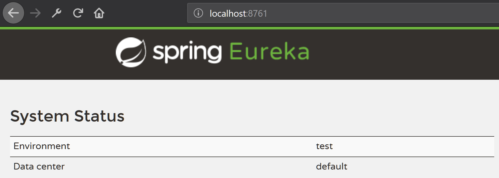
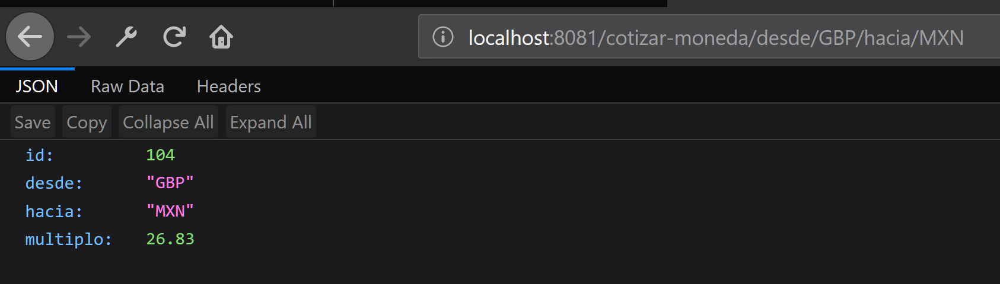
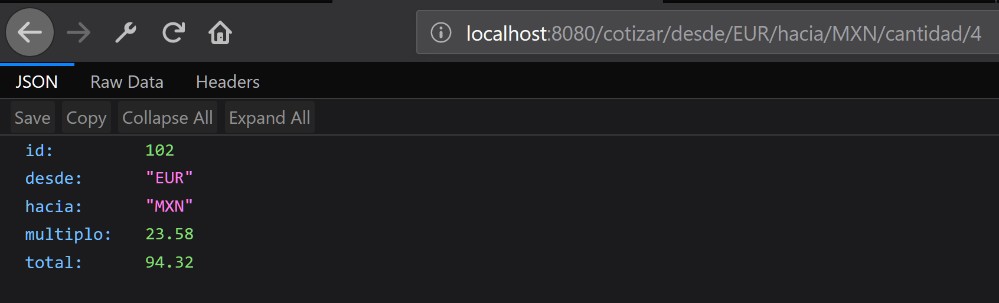

# Spring Boot y Microservicicios

## Microservicio-Eureka
[http://localhost:8761/eureka/](http://localhost:8761/eureka/)

## Microservicio-Forex

[http://localhost:8081/cotizar-moneda/desde/GBP/hacia/MXN](http://localhost:8081/cotizar-moneda/desde/GBP/hacia/MXN)

Lo mismo pasa con
* [AUS](http://localhost:8081/cotizar-moneda/desde/AUS/hacia/MXN)
* [CAD](http://localhost:8081/cotizar-moneda/desde/CAD/hacia/MXN)
* [EUR](http://localhost:8081/cotizar-moneda/desde/EUR/hacia/MXN)
* [USD](http://localhost:8081/cotizar-moneda/desde/USD/hacia/MXN)

## Microservicio Cotizador 

[http://localhost:8080/cotizar/desde/EUR/hacia/MXN/cantidad/4](http://localhost:8080/cotizar/desde/EUR/hacia/MXN/cantidad/4)

* [AUS](http://localhost:8080/cotizar/desde/AUS/hacia/MXN/cantidad/4)
* [CAD](http://localhost:8080/cotizar/desde/CAD/hacia/MXN/cantidad/4)
